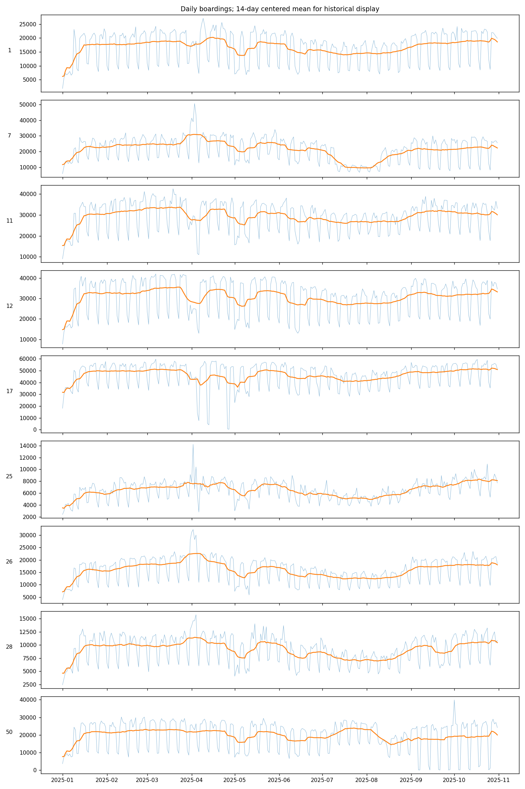
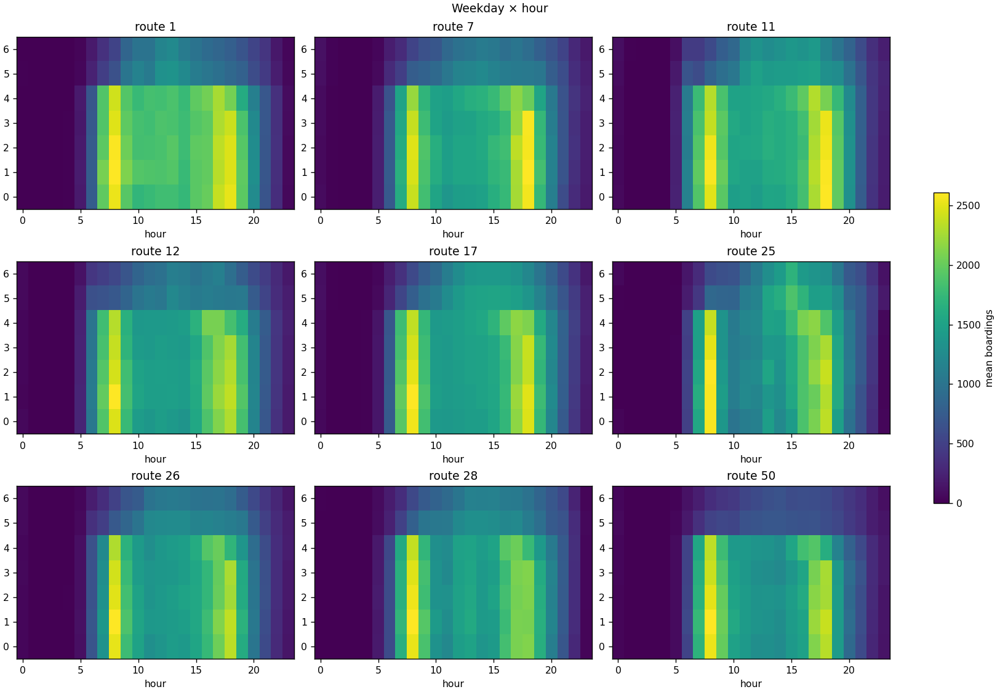
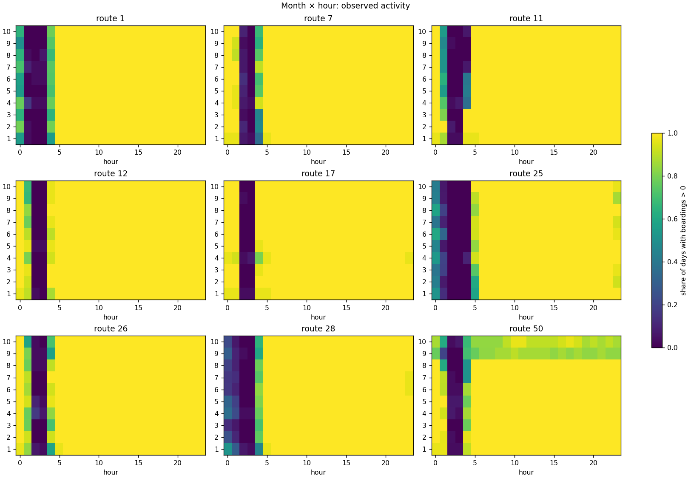
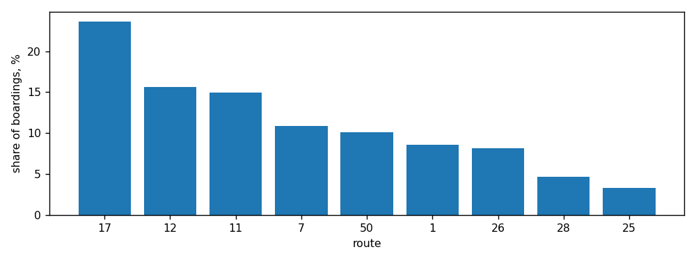

# Краткий sanity-check и EDA

## 1. Данные

История охватывает январь–октябрь 2025. Единица наблюдения — `route × date × hour`. Labels включают 9 маршрутов, тогда как submission требует 10; прогнозный период — ноябрь–декабрь 2025. Labels — разреженные агрегаты наблюдавшихся посадок, а submission содержит полную почасовую сетку.

## 2. Sanity-check

В `labels_day_train.csv` — 46 234 строки, в `labels_day_test.csv` — 11 317. `hour` принимает значения 0–23; дублей ключа, отрицательных `boardings` и явных строк `boardings=0` нет. Полная сетка для 9 маршрутов и 304 дней содержит 65 664 комбинации, из них отсутствуют 8 113 (12,4%).

Raw spot-check восьми отсутствующих комбинаций не нашёл успешных валидаций; пять проверенных положительных контрольных ячеек совпали с labels. Это поддерживает рабочую интерпретацию пропусков как `boardings=0`, но не доказывает её для каждой из 8 113 ячеек.

## 3. Route 5

Route 5 включён в submission, но отсутствует в labels. За январь–октябрь в raw найдена одна транзакция route 5 — 29.10.2025; она неуспешная. Положительной истории target нет. Это открытый вопрос организаторам; отсутствие исторических посадок само по себе не подтверждает нулевой поток в будущем.

## 4. Суточная структура

У маршрутов 1, 12, 25, 26, 28 и 50 максимум среднего числа посадок приходится на 08:00, у маршрутов 7, 11 и 17 — на 18:00. В 02:00–03:00 положительные посадки редки; в 00:00 и 23:00 они часто наблюдаются. Суточные профили маршрутов отличаются.

## 5. Рабочие дни и выходные

Поток выходного дня заметно ниже рабочего, причём эффект зависит от маршрута. Для маршрутов, кроме route 50, отношение среднего weekend/workday составляет примерно 47–72%. Route 50 имеет отдельный резкий сдвиг в сентябре–октябре.

## 6. Изменения по месяцам

Изменения заметнее на краях суток, центральные часы стабильнее. Медиана числа активных часов снижается с 22 в январе–июне до 21 в июле–октябре. Это изменение окна наблюдаемых посадок, а не доказанное изменение расписания.

## 7. Уровень и временные изменения

Средний дневной поток октября выше января на 11–52% в зависимости от маршрута. Однако сравнение марта с октябрём даёт от −9% до +16%, поэтому простой монотонный тренд Jan–Oct не подтверждается. Январское сравнение чувствительно к праздничному периоду. У route 50 медиана посадок в выходные меняется примерно с 9–14 тыс. в отдельные месяцы января–августа до 53 в сентябре и 451 в октябре.

## 8. Вклад маршрутов

Routes 17, 12 и 11 дают соответственно 23,63%, 15,65% и 14,99% всех исторических посадок — вместе около 54,27%. Пять крупнейших маршрутов дают около 75,25%.

## 9. Аномалии и вопросы

- Route 5 почти не представлен в транзакциях и не имеет положительной истории target.
- На route 50 полностью отсутствуют labels за 21.09.2025; также резко изменилось поведение выходных в сентябре–октябре.
- На route 17 отмечены необычно низкие значения 26–27 апреля: 673 и 323 посадки.

Аномалия не означает ошибку данных. Такие дни нельзя автоматически удалять или исправлять без выяснения причины.

## 10. Что мы пока не утверждаем

- Ненулевые часы не задают расписание движения.
- Изменение окна активных посадок не доказывает изменение расписания.
- Данные не подтверждают простой линейный годовой тренд.
- Найденные аномалии нельзя автоматически исправлять.
- Route 5 нельзя автоматически считать нулевым в будущем только из-за отсутствия положительной истории.

## 11. Вопросы организаторам

1. Почему route 5 включён в submission при практически полном отсутствии исторических транзакций?
2. Ожидается ли реальный пассажиропоток route 5 в ноябре–декабре?
3. Были ли известные изменения режима или расписания route 50 начиная с сентября?
