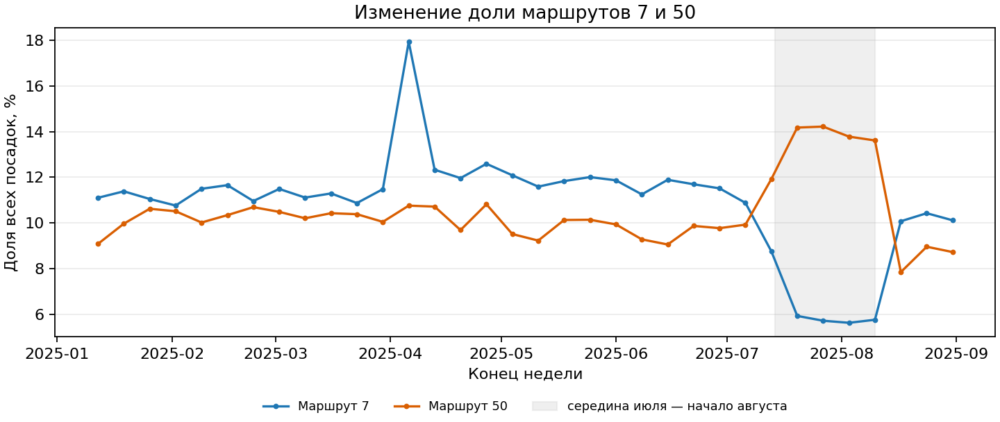

# Краткий sanity-check и EDA

## 1. Данные

История охватывает январь–октябрь 2025. Единица наблюдения — `route × date × hour`. Labels включают 9 маршрутов, тогда как submission требует 10; прогнозный период — ноябрь–декабрь 2025. Labels — разреженные агрегаты наблюдавшихся посадок, а submission содержит полную почасовую сетку.

## 2. Sanity-check

В `labels_day_train.csv` — 46 234 строки, в `labels_day_test.csv` — 11 317. `hour` принимает значения 0–23; дублей ключа, отрицательных `boardings` и явных строк `boardings=0` нет. Полная сетка для 9 маршрутов и 304 дней содержит 65 664 комбинации, из них отсутствуют 8 113 (12,4%).

Raw spot-check восьми отсутствующих комбинаций не нашёл успешных валидаций; пять проверенных положительных контрольных ячеек совпали с labels. Это поддерживает рабочую интерпретацию пропусков как `boardings=0`, но не доказывает её для каждой из 8 113 ячеек.

## 3. Route 5

Route 5 включён в submission, но отсутствует в labels. За январь–октябрь в raw найдена одна транзакция route 5 — 29.10.2025; она неуспешная. Положительной истории target нет. Это открытый вопрос организаторам; отсутствие исторических посадок само по себе не подтверждает нулевой поток в будущем.

## 4. Суточная структура

У маршрутов 1, 12, 25, 26, 28 и 50 максимум среднего числа посадок приходится на 08:00, у маршрутов 7, 11 и 17 — на 18:00. В 02:00–03:00 положительные посадки редки; в 00:00 и 23:00 они часто наблюдаются. Суточные профили маршрутов отличаются.

## 5. Рабочие дни и выходные

Поток выходного дня заметно ниже рабочего, причём эффект зависит от маршрута. Для маршрутов, кроме route 50, отношение среднего weekend/workday составляет примерно 47–72%. Route 50 имеет отдельный резкий сдвиг в сентябре–октябре.

## 6. Изменения по месяцам

Изменения заметнее на краях суток, центральные часы стабильнее. Медиана числа активных часов снижается с 22 в январе–июне до 21 в июле–октябре. Это изменение окна наблюдаемых посадок, а не доказанное изменение расписания.

## 7. Уровень и временные изменения

Средний дневной поток октября выше января на 11–52% в зависимости от маршрута. Однако сравнение марта с октябрём даёт от −9% до +16%, поэтому простой монотонный тренд Jan–Oct не подтверждается. Январское сравнение чувствительно к праздничному периоду. У route 50 медиана посадок в выходные меняется примерно с 9–14 тыс. в отдельные месяцы января–августа до 53 в сентябре и 451 в октябре.

## 8. Вклад маршрутов

Routes 17, 12 и 11 дают соответственно 23,63%, 15,65% и 14,99% всех исторических посадок — вместе около 54,27%. Пять крупнейших маршрутов дают около 75,25%.

## 9. Аномалии и вопросы

- Route 5 почти не представлен в транзакциях и не имеет положительной истории target.
- На route 50 полностью отсутствуют labels за 21.09.2025; также резко изменилось поведение выходных в сентябре–октябре.
- На route 17 отмечены необычно низкие значения 26–27 апреля: 673 и 323 посадки.

Аномалия не означает ошибку данных. Такие дни нельзя автоматически удалять или исправлять без выяснения причины.

## 10. Что мы пока не утверждаем

- Ненулевые часы не задают расписание движения.
- Изменение окна активных посадок не доказывает изменение расписания.
- Данные не подтверждают простой линейный годовой тренд.
- Найденные аномалии нельзя автоматически исправлять.
- Route 5 нельзя автоматически считать нулевым в будущем только из-за отсутствия положительной истории.

## 11. Вопросы организаторам

1. Почему route 5 включён в submission при практически полном отсутствии исторических транзакций?
2. Ожидается ли реальный пассажиропоток route 5 в ноябре–декабре?
3. Были ли известные изменения режима или расписания route 50 начиная с сентября?

## 12. Углублённый EDA `train.csv` (январь–август 2025)

### Метод и границы

Единица прогноза — `(route, date, hour)`, target — число успешных посадок. Проверен весь `data/raw/train.csv`: маршрут взят из `ngpt_route`, время из `tran_date_time`, успешная посадка означает `validation_result = 1`. Для почасового анализа использована существующая полная сетка `data/processed/baseline_train_hourly.csv`, ранее полученная из raw по этому правилу. Все её 46 234 положительные ячейки и их значения повторно сопоставлены с `labels/labels_day_train.csv` — расхождений нет. Новые признаки и модели не создавались.

**Подтверждённый факт.** В `train.csv` 49 051 926 строк и 14 столбцов. По `tran_date_time` файл охватывает 01.01–01.09.2025. Хвост 01.09 содержит 550 транзакций, в том числе 523 успешные: при анализе января–августа его нужно исключать по календарной дате, а не по имени файла. За 01.01–31.08 получено 46 912 710 посадок.

### Структура и качество транзакций

**Подтверждённые факты.** Во всём файле встречаются девять маршрутов (1, 7, 11, 12, 17, 25, 26, 28, 50); route 5 отсутствует. Поля `tran_date_time`, `ngpt_route`, `validation_result` заполнены во всех строках. Все номера маршрутов удалось извлечь; строки даты и часа имеют ожидаемый формат.

| Поле | Пропусков во всём raw | Доля | Значение для EDA |
|---|---:|---:|---|
| `pass_route` | 22 516 456 | 45,90% | Не заменяет `ngpt_route`. |
| `begin_date_time` | 4 794 872 | 9,78% | Не заменяет время валидации. |
| `garage_number` | 383 141 | 0,78% | Полнота меняется во времени. |
| `place_id`, `good_type`, `bus_exit_no` | 155, 49, 32 | менее 0,001% каждое | `place_id` не является остановкой. |

У `garage_number` в апреле 183 937 пропусков (2,75% апрельских событий), в августе 9 559 (0,17%). Это изменение полноты поля, а не доказательство изменения парка. В первых 500 000 строк `tran_no` имеет только 39 604 уникальных значений — использовать его как уникальный ключ строки нельзя; это выборочная проверка.

В детерминированной выборке 2% строк (каждая 50-я в каждом блоке; 981 039 строк) `input_date_time` позже `tran_date_time` более чем на час в 9,87% и более чем на сутки в 5,04% случаев. `begin_date_time` более чем на сутки раньше времени валидации в 1,07% строк выборки. Проценты по задержкам относятся **только к выборке**. Текстовые категории raw требуют чтения преимущественно как CP1251; при чтении как UTF-8 названия искажаются. Даже при декодировании CP1251 с заменой ошибок `good_type` содержит символ замены `�` в 120 053 строках (0,245%): часть тарифных названий повреждена.

### Распределение target и маршрутные различия

**Подтверждённые факты.** Полная сетка девяти наблюдавшихся маршрутов за 243 дня содержит 52 488 маршрут-часов. Из них 46 234 положительных и 6 254 нулевых (11,9%). Нули восстановлены как отсутствие успешных валидаций в raw; у девяти маршрутов нет полностью нулевых дней. Отсутствие посадок не доказывает отсутствие движения. Route 5 не имеет положительной истории в январе–августе, но это не доказывает нулевой поток в будущем.

По полной девятимаршрутной сетке медиана почасового target — 573, p90 — 2 285, p99 — около 3 934. В 06:00–22:00 нет нулевых маршрут-часов; в 02:00 и 03:00 положительных ячеек лишь 52 и 26 из 2 187 соответственно. Эти два часа дают 4 296 из 6 254 нулей (68,7%). При этом 00:00 и 23:00 часто ненулевые.

| Маршрут | Доля посадок Jan–Aug | Среднее посадок/день | Выходной / будний день |
|---:|---:|---:|---:|
| 1 | 8,50% | 16 403 | 0,48 |
| 7 | 10,96% | 21 165 | 0,58 |
| 11 | 15,00% | 28 952 | 0,64 |
| 12 | 15,68% | 30 270 | 0,55 |
| 17 | 23,53% | 45 417 | 0,65 |
| 25 | 3,25% | 6 270 | 0,72 |
| 26 | 8,08% | 15 596 | 0,59 |
| 28 | 4,63% | 8 943 | 0,60 |
| 50 | 10,38% | 20 040 | 0,44 |

Три крупнейших маршрута, 17, 12 и 11, дают 54,20% всех посадок. Совокупная метрика, взвешенная потоком, поэтому может скрывать плохие результаты на малых маршрутах и редких часах.

### Суточная, недельная и месячная динамика

**Подтверждённые факты.** По всем дням максимум среднего часового потока приходится на 08:00 у маршрутов 1, 12, 25, 26, 28, 50 и на 18:00 у 7, 11, 17. Часы 07:00–09:00 и 16:00–19:00 дают 50,5% всех посадок. В выходные максимум каждого маршрута смещается примерно к 13:00–17:00. В 08:00 средний поток выходного составляет 26% буднего, в 13:00–14:00 — 82–83%. Общий эффект выходного сильно зависит от маршрута (таблица выше).

Средний суммарный поток в день: 179 591 в январе, 216 731 в марте и 171 290 в августе; март–август — снижение на 21%. Январь включает очень низкие дни, например 01.01 с 54 813 посадками, поэтому сравнение с ним чувствительно к составу дат. Медиана часов с посадками на маршрут-день равна 22 в январе–июне и 21 в июле–августе. Это наблюдаемая динамика **одного года**; повторяющуюся годовую сезонность и изменение расписания из неё вывести нельзя.

### Сдвиги и аномалии, важные для validation

**Подтверждённый факт.** У маршрутов 7 и 50 в середине лета наблюдается противонаправленный сдвиг. Окна ниже состоят из полных недель, так что состав дней недели внутри каждого окна одинаков.

| Период | Дней | Маршрут 7: посадок/день; доля системы | Маршрут 50: посадок/день; доля системы |
|---|---:|---:|---:|
| 02–29.06 | 28 | 21 590; 11,57% | 17 743; 9,51% |
| 14.07–10.08 | 28 | 9 661; 5,77% | 23 366; 13,95% |
| 11–31.08 | 21 | 18 093; 10,21% | 15 112; 8,53% |

В среднем окне маршрут 7 потерял 55,3% посадок относительно июня, а 50 вырос на 31,7%. Доля успешных валидаций **среди транзакций маршрута 7** почти одинакова: 95,58% в июньском окне и 95,57% в окне 14.07–10.08. Следовательно, спад не объясняется одним лишь ростом доли неуспешных валидаций. Причина сдвига по этим данным неизвестна.

**Подтверждённый факт.** У маршрута 17 есть аномально низкие апрельские выходные. 26.04 отмечено 673 посадки при локальной медиане сравнимых суббот около 38 070 (1,8%), 27.04 — 323 против около 32 259 (1,0%). За оба дня в raw всего 1 042 транзакции, из них 996 успешных (95,6%). 05–06 и 12–13 апреля тоже ниже соседних выходных, тогда как 19–20 апреля выглядят обычно. Аномальные дни нельзя автоматически удалять или исправлять.

За пределами `train.csv`, в `labels_day_test.csv`, у route 50 нет положительных labels за 21.09.2025 и наблюдается резкое снижение потока выходного дня в сентябре–октябре (разделы 7 и 9). Это отдельный контекст для временной проверки, а не находка из `train.csv`.

### Транзакционные поля и риск утечки

**Подтверждённые факты.** В raw 15 кодов `validation_result`; target считает только код 1. Доля успешных событий была 96,52% в феврале–марте и снизилась до 94,55% в августе. Состав `tran_type_id` также меняется: доля типа 52 — с 76,49% в марте до 71,20% в августе, типа 75 — с 8,69% до 11,36%. За весь файл успешны 98,34% событий типа 52 и 77,65% событий типа 75. Это связь с результатом текущей транзакции, а не готовый прогнозный сигнал. Смысл кодов требует подтверждения.

Состав `good_type` тоже нестационарен: доля категории «СКМ МГТ» среди всех транзакций снизилась с 34,19% в январе до 30,75% в августе, а «30 дней» выросла с 14,20% до 17,63%. Эти доли посчитаны по декодированным CP1251 значениям; повреждённые названия учтены отдельно как записаны. Фактические поля карты, устройства, тарифа, результата валидации и времени загрузки возникают в момент транзакции; их значения на будущем 61-дневном горизонте ещё неизвестны. Подстановка будущих фактов в validation была бы утечкой.

## 13. Гипотезы для будущих экспериментов — не подтверждённые причины

1. Июльский спад route 7 и рост route 50 могут отражать изменение движения или перераспределение поездок; альтернатива — изменение регистрации. Проверка: внешнее расписание, выпуск транспорта и независимые данные о валидаторах.
2. Апрельские выходные route 17 могут отражать перерыв движения либо неполный сбор событий. Стабильная доля успешных валидаций не различает их. Проверка: внешний журнал движения и полнота устройств по датам.
3. Часть низких дней января и мая может объясняться календарём праздников; альтернатива — разовые события. Проверка: календарь и независимые временные отрезки с отдельным анализом по маршруту/часу.
4. Изменение типов транзакций и доли успеха может сопровождать изменение спроса, но будущий состав транзакций неизвестен. Проверка: подтвердить смысл кодов и оценивать только исторические агрегаты, доступные до начала прогнозного горизонта.
5. Мартовский максимум и летнее снижение могут повторяться ежегодно; альтернатива — особенности 2025 года. Для проверки нужна более длинная история или независимые внешние ряды.

## 14. Открытые вопросы и краткий итог

- **Главные особенности:** разные масштабы и суточные/недельные профили маршрутов, 11,9% нулевых часов, выраженные сдвиги внутри 2025 года.
- **Аномалии и риски:** летний сдвиг 7/50, отдельные апрельские выходные 17, отсутствие положительной истории route 5, сентябрьский хвост raw, пропуски и задержанные временные поля.
- **Гипотезы:** временные изменения движения или учёта, календарные эффекты, возможная годовая сезонность и нестабильный состав транзакций — ни одна причина пока не установлена.
- **Открыто:** почему route 5 включён в submission; что происходило на 7/50, 17 и затем 50 в сентябре–октябре; что обозначают коды транзакций; есть ли независимые данные о движении и более длинная история.

## ИНТЕРПРИТАЦИЯ НОРМАЛЬНЫМ ЯЗЫКОМ
По данным видно, что задача действительно имеет выраженную **временную структуру**: единица прогноза — `route × date × hour`, а пассажиропоток сильно зависит от маршрута, часа и типа дня. У разных маршрутов разные часы пик: у части максимум приходится примерно на 08:00, у других — на 18:00. При этом около половины всех посадок приходится на интервалы 07:00–09:00 и 16:00–19:00. В выходные поток заметно ниже буднего, а сам пик смещается ближе к дневным часам.

В labels отсутствуют явные строки с `boardings=0`: часть комбинаций `route × date × hour` просто отсутствует. Проверка raw-данных поддерживает гипотезу, что такие пропуски можно восстанавливать как нулевые посадки. Особенно много нулей приходится на 02:00–03:00, тогда как в дневные часы поток практически всегда ненулевой. При этом отсутствие посадок не означает, что транспорт в этот момент не ходил. 

Также обнаружена заметная **нестационарность данных**. Например, летом поток route 7 временно снизился примерно на 55%, тогда как у route 50 в тот же период вырос примерно на 32%. У route 17 есть отдельные дни с аномально низким пассажиропотоком. Причины этих изменений по имеющимся данным определить нельзя, поэтому такие наблюдения нельзя автоматически считать ошибками и удалять. Кроме того, route 5 присутствует в будущем submission, но практически не имеет исторических данных, поэтому для него возникает отдельная проблема cold start. 

Из-за временных сдвигов validation необходимо делать **по времени**, а не случайным `train_test_split`. Для baseline наиболее очевидные признаки — маршрут, час, день недели, выходной/будний, месяц, а дальше можно добавлять лаги и исторические агрегаты. Транзакционные признаки текущего будущего часа (`validation_result`, тариф, устройство и т. п.) напрямую использовать нельзя, так как их значения в момент построения прогноза ещё неизвестны и это приведёт к leakage.

### Гипотезы по результатам EDA

- **Час, маршрут и тип дня** будут одними из наиболее сильных признаков, причём важны их взаимодействия: `route × hour`, `hour × weekend`.
- Праздники и календарные события могут объяснять часть сильных падений пассажиропотока, особенно в январе и отдельные выходные.
- Сдвиги route 7 и route 50 могут быть связаны с изменением маршрутов, расписания, выпуска транспорта или особенностями регистрации валидаций.
- Аномально низкие дни route 17 могут отражать реальные ограничения движения либо проблемы полноты данных.
- В данных может присутствовать сезонность, но одного 2025 года недостаточно, чтобы уверенно говорить о повторяющейся годовой сезонности.
- Для route 5, вероятно, понадобится отдельная стратегия cold start, поскольку исторического target практически нет.