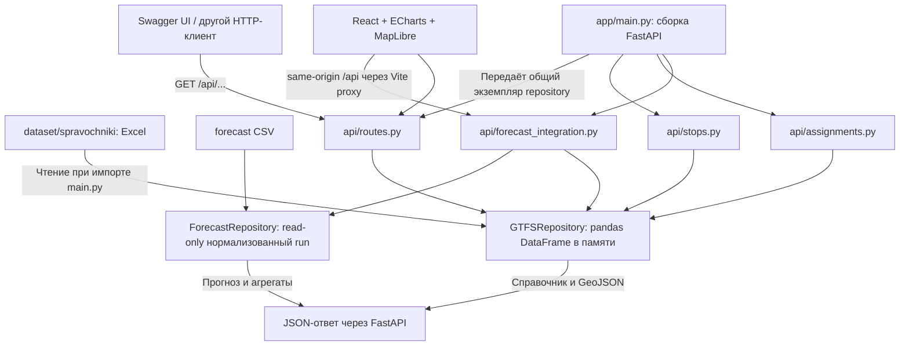

# Текущая архитектура репозитория MTTECH

Состояние реализации на 26.09.2026. Документ описывает существующий код основного репозитория. План развития и будущие контракты находятся отдельно в [ТЗ 4.2](spec/README.md). Реализованы frontend-этап FE-03 и read-only интеграция UI с FastAPI поверх CSV. PostgreSQL, атомарная публикация run, внешний POST-прогноз и собственный итоговый ML-run пока отсутствуют.

## 1. Общее устройство

Проект предназначен для прогнозирования пассажиропотока трамваев. Работающая серверная часть — HTTP API на FastAPI: она загружает Excel-справочник и CSV-прогноз в память, затем выдаёт прогнозы, агрегаты, GeoJSON, маршруты, остановки и наряды.

Рядом подготовлена структура каталогов для данных и ML. Есть исследовательский notebook, но воспроизводимый ML-пайплайн ещё не реализован. В корневом `frontend/` работают DAY/MONTH/PERIOD, ALL, KPI, диапазоны, CSV и справочная MapLibre-карта. FastAPI теперь предоставляет совместимый read-only API поверх настраиваемого CSV; целевая PostgreSQL-публикация run ещё не готова.

Архитектурно backend представляет собой одно Python-приложение с разделением HTTP-обработчиков и доступа к данным. Excel-справочник и CSV прогноза загружаются в память при старте. Отдельной базы данных и сервисов очередей нет.



ML-обучение не включено в цепочку HTTP-запроса: API читает уже подготовленный прогнозный run.

Frontend FE-03 запускается независимо:

```text
development: React → HttpForecastClient → /api → Vite proxy → FastAPI :8000
production:  React → HttpForecastClient → same-origin /api или VITE_API_BASE_URL
fixtures:    FixtureForecastClient → React + ECharts + MapLibre
```

API является режимом по умолчанию. Fixtures включаются только явно через `VITE_DATA_SOURCE=fixtures`, не используются как автоматический fallback после HTTP-ошибки и запрещены в production build.

## 2. Структура каталогов

```text
MTTECH/
├── requirements.txt
├── .gitignore
├── experiments.ipynb
├── dataset/
│   └── spravochniki/
│       └── Хакатон_справочники_трамвай_10_маршрутов.xlsx
├── data/
│   ├── README.MD
│   ├── raw/
│   ├── interim/
│   └── processed/
├── ml/
│   ├── README.MD
│   ├── notebooks/
│   ├── src/
│   └── models/
├── web-forecast/
│   └── app/
│       ├── __init__.py
│       ├── main.py
│       ├── api/
│       │   ├── __init__.py
│       │   ├── routes.py
│       │   ├── stops.py
│       │   ├── assignments.py
│       │   └── forecast_integration.py
│       └── repositories/
│           ├── __init__.py
│           ├── gtfs_repository.py
│           └── forecast_repository.py
├── frontend/
│   ├── package.json
│   ├── package-lock.json
│   ├── vite.config.ts
│   └── src/
│       ├── api/                 # DTO, интерфейс и HTTP-адаптер
│       ├── dev/                 # детерминированные fixtures
│       ├── hooks/
│       ├── components/
│       ├── pages/
│       └── styles/
├── docs/
│   ├── CURRENT_ARCHITECTURE.md
│   └── spec/
└── MT-Hackathon-2026/           # отдельная вложенная копия проекта
```

| Область | Фактическая роль |
|---|---|
| `web-forecast/app/` | Исполняемый backend |
| `frontend/` | FE-03: DAY/MONTH/PERIOD/ALL, KPI, CSV, ECharts, lazy MapLibre и API/fixture-адаптеры |
| `dataset/spravochniki/` | Excel, который непосредственно читает backend |
| `data/` | Предусмотренные стадии хранения ML-данных; в отслеживаемой структуре — README и `.gitkeep` |
| `ml/` | Документированное разделение исследований, кода и моделей; рабочие модули пока отсутствуют |
| `experiments.ipynb` | Самостоятельные исследования на стороннем датасете |
| `docs/spec/` | Требования к будущей реализации, не описание уже работающих компонентов |

Вложенный `MT-Hackathon-2026/` имеет собственный `.git` и более ранний каркас приложения. Он не импортируется основным backend и не является его микросервисом. В нём другие версии файлов: API со статическими маршрутами/остановками и подключённой тестовой заглушкой прогноза. Запуск из разных корней поэтому даёт различное поведение.

## 3. Точка входа и запуск

Точка входа — [web-forecast/app/main.py](../web-forecast/app/main.py), объект приложения — `app`.

Последовательность инициализации:

1. По расположению `main.py` определяется корень проекта: `Path(__file__).resolve().parents[2]`.
2. Пути к Excel и прогнозному CSV берутся из `GTFS_EXCEL_PATH` и `FORECAST_CSV_PATH`; предусмотрены локальные значения по умолчанию.
3. Создаются `GTFSRepository` и, при наличии CSV, `ForecastRepository`; оба источника читаются один раз.
4. Создаётся FastAPI с названием `Tram Forecast API` и версией `0.1.0`.
5. Подключается CORS middleware.
6. Регистрируются forecast/map/reference endpoint, а также прежние роутеры маршрутов, остановок и нарядов с префиксом `/api`.
7. Регистрируются служебные обработчики `/` и `/health`.

Загрузка источников происходит при импорте Python-модуля, до готовности приложения обслуживать запросы. Отдельного lifespan-обработчика нет. Если Excel отсутствует либо чтение/проверка его схемы завершается ошибкой, приложение не запускается. При отсутствии прогнозного CSV справочные endpoint сохраняются, а `/health` сообщает `degraded` и `forecast_loaded=false`.

Запуск из корня основного проекта:

```powershell
python -m pip install -r requirements.txt
python -m uvicorn app.main:app --app-dir web-forecast --host 127.0.0.1 --port 8000
```

После запуска документация FastAPI доступна по `/docs`, OpenAPI — по `/openapi.json`. `/health` сообщает состояние загрузки прогнозного источника, но не проверяет готовность ML или PostgreSQL.

## 4. HTTP-слой

Обработчики разделены по сущностям:

| Файл | Содержание |
|---|---|
| [api/routes.py](../web-forecast/app/api/routes.py) | Список маршрутов, поиск по короткому номеру и GTFS ID |
| [api/stops.py](../web-forecast/app/api/stops.py) | Список остановок и поиск по ID |
| [api/assignments.py](../web-forecast/app/api/assignments.py) | Наряды с фильтрами по маршруту и дате |
| [api/forecast_integration.py](../web-forecast/app/api/forecast_integration.py) | Read-only прогнозы, агрегаты, экспорт и справочная география |

Справочные модули используют фабрики `create_routes_router(repository)`, `create_stops_router(repository)` и `create_assignments_router(repository)`. Интеграционный роутер создаётся через `create_forecast_router(forecast_repository, gtfs_repository)`. `main.py` передаёт им общие экземпляры репозиториев.

Таким образом, зависимости передаются явно при сборке приложения. Механизм FastAPI `Depends` здесь не используется. Отдельного слоя бизнес-сервисов и собственных Pydantic-моделей ответов нет: обработчики возвращают словари и списки, полученные из репозитория. Все текущие обработчики синхронные (`def`).

### Доступные endpoint

| URL | Назначение и форма ответа |
|---|---|
| `GET /` | Название сервиса, статус, версия, ссылки на docs и health |
| `GET /health` | Статус сервиса, наличие и имя прогнозного источника |
| `GET /api/forecast/runs`, `/runs/{run_id}`, `/routes` | Активный run, метаданные и каталог прогнозируемых маршрутов |
| `GET /api/forecast`, `/point`, `/timeseries`, `/aggregate` | DAY/POINT и диапазонные данные для графиков и KPI |
| `GET /api/export.csv` | CSV текущего среза |
| `GET /api/map/routes` | GeoJSON маршрутов с прогнозным `load_index` |
| `GET /api/routes/number/{route}/geometry`, `/directions`, `/stops` | Справочная география и навигация карты |
| `GET /api/routes` | `{count, routes}` |
| `GET /api/routes/number/{route_number}` | Первая найденная запись маршрута по короткому номеру; иначе 404 |
| `GET /api/routes/{route_id}` | Первая найденная запись по GTFS ID; иначе 404 |
| `GET /api/stops` | `{count, stops}` |
| `GET /api/stops/{stop_id}` | Первая найденная запись остановки; иначе 404 |
| `GET /api/assignments` | `{count, filters, assignments}`, параметры `route_id` и `date` необязательны |
| `GET /api/assignments/routes/{route_id}` | `{route_id, date, count, vehicles}`, параметр `date` необязателен |

`route_id`, `route_number`, `stop_id` и дата фильтра нарядов принимаются как строки. Для текущего справочника пример даты наряда — `20260208`. Специальной проверки календарного формата здесь нет: выполняется строковое сравнение.

Поле `vehicles` в ответе нарядов содержит записи нарядов, а не вычисленный список уникальных вагонов. Несколько смен одного вагона могут дать несколько записей.

## 5. Репозиторий справочников

[GTFSRepository](../web-forecast/app/repositories/gtfs_repository.py) объединяет чтение Excel, базовую проверку колонок, фильтрацию и преобразование значений для JSON.

### Загружаемые данные

| Атрибут объекта | Лист Excel | Строк в проверенном файле |
|---|---|---:|
| `routes` | `Маршруты GTFS_ROUTES` | 10 |
| `stops` | `Остановки GTFS_STOPS` | 489 |
| `trips_stops` | `Порядок_остановок GTFS_TRIPS_ST` | 622 |
| `assignments` | `Наряд` | 15 |
| `schedule` | `Расписание` | 15 |
| `stops_coordinates` | `Порядок_с_координатами` | 622 |

Для первых пяти листов строка заголовков читается с `header=1`: перед названиями колонок есть пояснение. Для `Порядок_с_координатами` используется `header=0`. Движок чтения — `openpyxl` через `pandas.read_excel`.

При загрузке удаляются полностью пустые строки, пробелы и BOM в именах колонок. Затем проверяется набор обязательных колонок для маршрутов, остановок и листа координат. Аналогичной отдельной проверки всех колонок нарядов и расписания сейчас нет. Информация о загрузке выводится через `print`.

### Чтение и выдача

- Методы `get_routes`, `get_route`, `get_route_by_number` обслуживают справочник маршрутов.
- `get_stops` и `get_stop` обслуживают справочник остановок.
- `get_assignments` фильтрует наряды по `route_id` и `date`.
- `get_trip_stops` выбирает строки по `trip_short_name`, дополнительно по направлению, затем сортирует по `stop_sequence`.
- `get_schedule` возвращает расписание; `get_stops_coordinates` — координатный лист с необязательными фильтрами.

Методы расписания и последовательностей остановок существуют на уровне Python, но отдельных HTTP endpoint для них в основном приложении нет.

Данные хранятся в pandas DataFrame на протяжении жизни процесса. На запрос выполняются фильтрация таблицы и преобразование результата в `list[dict]`. `_clean_value` заменяет отсутствующие значения на `None`, преобразует даты через `isoformat` и скалярные типы NumPy через `item`.

Готового кэша JSON, составных индексов словарей, SQL-запросов и сохранения изменений нет. Excel повторно на каждый GET не читается; изменения файла автоматически в работающий процесс не подхватываются. При нескольких серверных процессах каждый создаёт собственный экземпляр репозитория и собственную копию таблиц в памяти.

## 6. Как проходит запрос

Например, для `GET /api/routes/number/1`:

1. FastAPI выбирает обработчик из `api/routes.py`.
2. Обработчик вызывает `repository.get_route_by_number("1")`.
3. Репозиторий сравнивает строковое представление `route_short_name` с `"1"`.
4. Подходящие строки DataFrame преобразуются в обычные Python-словари.
5. Обработчик возвращает первую запись либо HTTP 404.
6. FastAPI формирует JSON-ответ.

ML-модель и notebook в этом процессе не участвуют. Прогнозные endpoint читают уже подготовленный CSV-run через `ForecastRepository`; обучение по HTTP не выполняется.

## 7. Идентификаторы и границы справочника

Короткий номер маршрута и GTFS ID — разные сущности. Например, номеру `1` соответствует `route_id=4450`. Именно поэтому в API существуют отдельные URL поиска по номеру и по ID.

В Excel представлены номера `1,2,3,4,5,6,7,10,11,12`. В конкурсной задаче нужны `1,5,7,11,12,17,25,26,28,50`. Поэтому текущий `/api/routes` не является полным каталогом маршрутов прогнозирования; например, поиск номера 17 возвращает 404.

В координатном листе `trip_short_name` у всех строк равен `0`. Существующий поиск только по этому полю может объединить остановки разных маршрутов. При этом в источнике есть более точные ключи `route_id`, `trip_id` и `direction_id` — это важная особенность текущей реализации, а не уже исправленное поведение.

GeoJSON строится из координат остановок по составному ключу маршрута, рейса и направления. Геометрия справочная: она не является фактическим треком движения на выбранную дату. Наряды относятся к 08.02.2026, а лист расписания содержит лишь 15 строк маршрута 1. Эти таблицы нельзя считать полным расписанием или телематикой на весь прогнозный период.

## 8. Read-only прогнозный адаптер

`ForecastRepository` загружает `;`-CSV формата `route;date;hour;prediction`, проверяет маршруты, часы, даты, пропуски и дубли, затем рассчитывает по каждому маршруту Q05/Q95-нормализацию, процент, индекс 1–10 и категорию загрузки. Источник читается один раз при старте.

Run получает детерминированный идентификатор по SHA-256 источника. Frontend использует один `run_id` для POINT, DAY, временных рядов, агрегатов, карты и CSV-экспорта. Это интеграционная граница, а не production-хранилище: PostgreSQL, Alembic и атомарная публикация run ещё не реализованы.

## 9. Frontend

Корневой `frontend/` — React 19 + TypeScript + Vite. Экран поддерживает DAY, MONTH и PERIOD, конкретный маршрут или ALL, KPI, ECharts-график, итог периода, таблицу маршрутов, CSV-экспорт и справочную MapLibre-карту.

Доступ к данным изолирован интерфейсом `ForecastDataClient`:

- `HttpForecastClient` — основной API-режим без автоматического перехода на fixtures;
- `FixtureForecastClient` — только явный development/test-режим;
- общие DTO находятся в `src/api/types.ts`, поэтому замена CSV-хранилища backend на PostgreSQL не должна менять UI-контракт.

Начальная загрузка получает активный run, его метаданные и каталог маршрутов. После выбора фильтров отдельные запросы загружают точку, график/агрегаты и географию. Состояние фильтров сохраняется в URL. Устаревшие ответы защищены sequence-id и `AbortController`; штатный браузерный `AbortError` не показывается как недоступность API.

В development браузер обращается к относительному `/api`, а Vite проксирует запросы в `VITE_DEV_API_TARGET` (`http://127.0.0.1:8000` по умолчанию). Порт Vite фиксирован на `5173` с `strictPort`, чтобы параллельный старый frontend не запускался незаметно на следующем порту. `VITE_API_BASE_URL` применяется только в production; при пустом значении ожидается same-origin reverse proxy.

Карта загружается отдельным lazy chunk. Цвет линии берётся из `load_index`: для DAY — из выбранного часа, для MONTH/PERIOD — из среднего индекса за диапазон. Прогноз относится к маршруту целиком; остановки и линии используются только как справочная география.

Локальная последовательность запуска:

```powershell
# терминал 1, корень MTTECH
$env:FORECAST_CSV_PATH="MT-Hackathon-2026/data/test_submission.csv"
python -m uvicorn app.main:app --app-dir web-forecast --host 127.0.0.1 --port 8000

# терминал 2
cd frontend
npm run dev
# http://127.0.0.1:5173/
```

## 10. ML и организация данных

### Каталоги данных

[data/README.MD](../data/README.MD) описывает последовательность:

```text
raw/        исходные данные без ручного изменения
  ↓
interim/    воспроизводимые промежуточные результаты
  ↓
processed/  подготовленные для модели данные
```

Это организационное соглашение. Скриптов, автоматически выполняющих переходы между стадиями, пока нет. Содержимое этих каталогов исключается из Git, кроме `.gitkeep`. Excel backend хранится отдельно, в `dataset/spravochniki/`, и отслеживается Git.

### Каталоги ML

[ml/README.MD](../ml/README.MD) предусматривает `notebooks/` для исследований, `src/` для воспроизводимого кода и `models/` для моделей. Сейчас в этих каталогах находятся файлы `.gitkeep`. Описанные в README `preprocessing.py`, `features.py`, `train.py`, `predict.py`, `evaluate.py` и `ml/requirements.txt` ещё не созданы.

### Исследовательский notebook

[experiments.ipynb](../experiments.ipynb) находится в корне, вне `ml/notebooks/`. Он загружает сторонний CSV из проекта открытых данных трамваев Коломны, строит признаки, сравнивает несколько моделей и содержит заготовки нейросетевых подходов.

Целевая переменная notebook — `passengers`; используются поездки, вагоны и остановки. Это другая постановка, чем конкурсный почасовой прогноз числа посадок по маршрутам. Notebook не импортируется backend, не образует единого CLI-пайплайна и не поставляет подключённую к API модель.

## 11. Зависимости и инфраструктура

В корневом [requirements.txt](../requirements.txt) перечислены:

| Библиотека | Роль |
|---|---|
| FastAPI | HTTP API и автоматическая документация |
| Uvicorn с standard extras | ASGI-сервер |
| pandas, openpyxl | Чтение и обработка Excel |
| NumPy | Численные операции и исследования |
| scikit-learn, joblib | Базовые средства ML и сериализации |

Версии зависимостей не закреплены. Часть библиотек notebook, включая LightGBM, CatBoost и PyTorch-компоненты, в этот файл не входит; установки корневого requirements недостаточно для всех экспериментов.

Frontend имеет npm-сборку и Vitest-тесты HTTP-клиента, страницы и карты. Сейчас отсутствуют БД, миграции, Docker/Compose, CI-конфигурация, полноценный backend/ML-тестовый набор и нагрузочные сценарии. Backend не содержит авторизации или операций записи. CORS ограничен настраиваемым списком origin и локальными loopback-адресами; основной development-поток использует same-origin Vite proxy.

## 12. Степень готовности компонентов

| Компонент | Состояние |
|---|---|
| Чтение Excel и выдача маршрутов/остановок/нарядов | Реализовано, проверено запросами через TestClient |
| Методы доступа к расписанию и координатам | Реализованы в репозитории, не опубликованы отдельными endpoint |
| Прогнозный HTTP API | Реализован read-only CSV-адаптер для frontend; production-хранилища нет |
| Прогнозная модель для конкурсного датасета | Не реализована как воспроизводимый модуль |
| Исследования моделей | Есть отдельный notebook на другом источнике данных |
| Организация ML-данных | Описана в README, каталоги подготовлены |
| Frontend DAY/MONTH/PERIOD/ALL, KPI и CSV | Реализован; основной режим подключён к FastAPI через Vite proxy, fixtures остаются явным test/dev-режимом |
| MapLibre и остановки | Реализованы поверх backend GeoJSON; DAY использует часовой индекс, MONTH/PERIOD — средний индекс диапазона; направление служебное, UI участка удалён |
| Метрики UI и выбор выпуска | Не реализованы; относятся к FE-04 |
| Импорт прогнозов, нормализация, экспорт | Есть read-only загрузка CSV, Q05/Q95-нормализация и экспорт; атомарной PostgreSQL-публикации нет |
| Обновлённые требования к развитию | Подготовлены в `docs/spec/` |

Backend проверен ответами `/health`, runs, POINT, aggregate, map, directions и stops; старые маршруты, остановки и наряды сохранены. Связка frontend → Vite proxy → FastAPI проверена на тестовом run из 14 640 строк. API-клиент, карта и страница прошли целевые тесты и production-сборку. PostgreSQL, обучение собственного прогноза и нагрузочные испытания не выполнялись.
