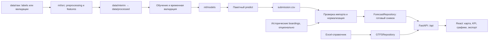

# ТЗ 3.0: сервис прогноза пассажиропотока трамваев

Дата: 25.09.2026. Статус: спецификация к реализации на основе текущего репозитория.

## 1. Назначение документов

Сервис показывает почасовой прогноз числа посадок по десяти трамвайным маршрутам: на карте, в графиках, показателях и CSV. ML готовит прогноз заранее; backend загружает его, рассчитывает относительную загрузку и предоставляет API; frontend отображает согласованные данные.

Комплект ТЗ:

| Документ | Содержание |
|---|---|
| [Общие требования](README.md) | Проверенное состояние, архитектура, контракт ML → Web, порядок интеграции |
| [Backend](BACKEND.md) | Развитие FastAPI, репозитории, импорт, нормализация, API, приёмка |
| [Frontend](FRONTEND.md) | Экран сервиса, состояния, карта, графики, взаимодействие с API, приёмка |
| [ML](ML.md) | Подготовка данных, валидация, обучение, пакетный прогноз, артефакты, приёмка |

Требования ниже описывают будущую реализацию. Формулировка «существует» используется только для проверенного кода и файлов. Команды, новые модули и endpoint из разделов требований необходимо реализовать.

Исходный `WEB_SERVICE_CODEX_v2.md` использован как описание концепции продукта, а не как команда переписать проект или внедрить весь перечисленный стек. Приоритет существующей архитектуры не означает сохранение заглушек, ошибок идентификации и утечек данных.

## 2. Основания и фактическое состояние

Проверены исходники основного репозитория на коммите `c999d3a`, все ячейки `experiments.ipynb`, README данных и ML, Excel-справочник, внешний README датасета, оба файла `labels` и пример submission. Выполнены запросы через FastAPI TestClient. Полный проход по сырым CSV объёмом около 10,4 ГБ и обучение моделей не выполнялись; качество модели и производительность сервиса не измерены.

Основной проект — корень `MTTECH/`. Вложенный `MT-Hackathon-2026/` является отдельным Git-репозиторием с более ранним каркасом (`d5140ce`), статическими маршрутами и остановками. Это не второй компонент сервиса; его структура не используется как целевая. Удаление или изменение вложенной копии не входит в это ТЗ.

| Область | Проверено в репозитории | Решение |
|---|---|---|
| Backend | [main.py](../../web-forecast/app/main.py), FastAPI, `/api`, `/health`, CORS | Сохранить приложение и URL-префикс |
| API | Фабрики `create_*_router(repository)` в [api/](../../web-forecast/app/api/) | Развивать тот же способ сборки |
| Справочник | [GTFSRepository](../../web-forecast/app/repositories/gtfs_repository.py), pandas/openpyxl, шесть листов Excel | Сохранить адаптер; добавить индексы, геометрию и точные ключи |
| Прогноз | [forecast.py](../../web-forecast/app/api/forecast.py) возвращает константу каждые 15 минут, содержит `stop_id`, `p10`, `p90`; роутер не подключён | Заменить почасовым контрактом и подключить |
| ML | [README](../../ml/README.MD), пустые каталоги `src`, `notebooks`, `models` | Реализовать воспроизводимый код в предусмотренных каталогах |
| Эксперименты | [experiments.ipynb](../../experiments.ipynb) использует сторонний датасет Коломны, target `passengers`, группы по вагону/остановке | Использовать идеи экспериментов после адаптации, не объявлять готовой моделью соревнования |
| Данные | [raw → interim → processed](../../data/README.MD), исходный Excel в `dataset/spravochniki/` | Сохранить расположение и разделение стадий |
| Frontend | Исходников, `package.json` и сборки нет | Создать `web-forecast/frontend/` |
| Хранилище и инфраструктура | БД, миграций, Docker, тестов и нагрузочного сценария нет | Для MVP использовать файлы и память; инфраструктуру добавлять по этапам |
| Зависимости | [requirements.txt](../../requirements.txt): FastAPI, Uvicorn, pandas, NumPy, openpyxl, scikit-learn, joblib; версии не закреплены | Зафиксировать проверенные версии при реализации; локальный Python — 3.11 |

Проверенные ответы: `/health` — 200; `/api/routes` — 10 записей справочника; `/api/stops` — 489 остановок; `/api/assignments` — 15 записей; `/api/routes/number/17` — 404; `/api/forecast` — 404. Это проверка текущего состояния, не приёмка новой функциональности.

Внешние источники, прочитанные для подготовки ТЗ:

- `C:/Users/User/Downloads/WEB_SERVICE_CODEX_v2.md` — продуктовая концепция версии 2.0.
- `C:/Users/User/Downloads/dataset/README.md` — правила соревнования, target, горизонт и формат submission.
- `C:/Users/User/Downloads/dataset/labels/*.csv`, `test_submission.csv` — проверка реальных схем и покрытия.

Эти локальные пути не должны быть зашиты в код. После клонирования данные предоставляются отдельно через конфигурацию.

## 3. Изменения относительно исходного ТЗ сервиса

| Вопрос | Принятое решение |
|---|---|
| PostgreSQL/PostGIS как обязательная основа | Отложить. MVP продолжает архитектуру репозиториев поверх файлов и памяти; БД — возможный следующий адаптер |
| `/api/v1` | Сохранить `/api`, а также существующий `/health`; не создавать две параллельные версии API |
| «Прогноз людей» | Точная единица: прогноз числа посадок, то есть успешных валидаций за час |
| CSV с запятыми | Основной формат `route;date;hour;prediction`, UTF-8, ISO-даты; импорт старого формата допускается явно |
| ML в HTTP-запросе | Пакетный ML-процесс; API читает готовый артефакт |
| `route_id` в старой заглушке | В прогнозе `route` — номер маршрута; GTFS `route_id` остаётся отдельным идентификатором |
| Маршруты из Excel | Продуктовый каталог всегда содержит все 10 конкурсных маршрутов; каталог GTFS сохраняется отдельно |
| Линия по координатам остановок | Это справочная ломаная между остановками, а не точная геометрия рельсов |
| Даты справочника | Показывать период действия и дату актуализации; не выдавать снимок справочника за историческое состояние сети |
| `relative_load=0.5` и индекс | Для обычной формулы индекс 6; для вырожденной нормализации явно сохраняется исключение — индекс 5 |
| Сотни RPS | Только целевой ориентир; результат подтверждается отдельным измерением |

## 4. Границы MVP

Обязательны:

1. Прогноз для маршрутов `1, 5, 7, 11, 12, 17, 25, 26, 28, 50` на каждый час периода `2025-11-01 … 2025-12-31` включительно.
2. Режимы одного маршрута и «Все маршруты», DAY и MONTH.
3. Показ числа посадок, относительной загрузки, индекса 1–10, графика и карты.
4. Работа прогноза для маршрутов без геометрии.
5. Экспорт отображаемого диапазона и отдельный валидный `submission.csv` от ML.
6. Воспроизводимый запуск, проверка данных, контрактные и интеграционные проверки.

В MVP не входят прогнозы по остановкам/вагонам, телематика, анимация движения, оптимизация выпуска, расчёт вместимости салона, личные кабинеты, онлайн-обучение и отдельные ML-микросервисы. Существующие наряды сохраняются как справочный API. Их наличие не даёт оснований считать заполненность вагонов.

## 5. Архитектура



Сохраняются `web-forecast/app/`, `ml/`, `data/` и `dataset/spravochniki/`. Предлагаемые новые каталоги:

```text
web-forecast/
  app/
    main.py                 # сборка зависимостей и подключение роутеров
    api/                    # существующие роутеры + прогноз, карта, экспорт
    repositories/           # GTFSRepository + ForecastRepository
    services/               # каталог, геометрия, нормализация, импорт
    schemas/                # явные модели запросов и ответов
  scripts/                  # import_forecasts, import_actuals, normalize
  tests/
  frontend/                 # React + TypeScript + Vite
ml/
  src/                      # preprocessing, features, train, predict, evaluate
  notebooks/
  models/
  tests/
data/
  raw/
  interim/
  processed/
docs/spec/                  # этот комплект ТЗ
```

Frontend использует React, TypeScript, Vite, MapLibre GL JS и ECharts из исходной концепции. Конкретные совместимые версии закрепляются при реализации. Дополнительные серверы очередей, кэшей и оркестраторы для MVP не нужны.

## 6. Общий контракт ML → Backend

Единственный обязательный файл ML для веба — `submission.csv`:

```csv
route;date;hour;prediction
1;2025-11-01;0;349
1;2025-11-01;1;349
```

| Поле | Тип и ограничение | Семантика |
|---|---|---|
| `route` | Целое из конкурсного множества | Короткий номер маршрута, не GTFS ID |
| `date` | `YYYY-MM-DD` | Календарная дата |
| `hour` | Целое 0–23 | Интервал `[hour:00, следующий час)` |
| `prediction` | Конечное число ≥ 0 | Ожидаемое число посадок на всём маршруте за час |

Требуется ровно 14 640 строк данных (`10 × 61 × 24`) плюс одна обязательная строка заголовка. Ключ `(route, date, hour)` уникален. Ночные нули допустимы и должны присутствовать явно. `NaN`, бесконечности, отрицательные значения и пропуски запрещены. Порядок строк при выдаче: `route`, `date`, `hour` по возрастанию. Десятичный разделитель — точка.

Для финального submission ML округляет неотрицательные значения по правилу `floor(x + 0.5)`. Импорт backend поддерживает и дробные конечные значения; хранит их без дополнительного округления. Суммы считаются до форматирования UI.

Часовой пояс продукта — `Europe/Moscow`, в целевом периоде UTC+03:00. Это принятое в ТЗ соглашение для локальных дат Москвы; исходные timestamp без timezone не следует автоматически считать UTC. Даты и часы API передаются как отдельные локальные значения, timestamp при необходимости — с явным смещением.

Дополнительный JSON с `model_version`, `generated_at`, `training_end`, seed, составом признаков, хешами источников и метриками полезен для воспроизводимости, но отсутствие файла не блокирует импорт корректного четырёхколоночного CSV. Backend формирует собственные `run_id`, время импорта, контрольную сумму и описание покрытия.

`p10`, `p50`, `p90`, проценты загрузки, остановки и геометрия от ML не требуются. Сумма посадок за сутки не является числом уникальных пассажиров.

## 7. Общая семантика отображения

- `prediction` — абсолютный поток посадок.
- `relative_load` — положение прогноза относительно распределения конкретного маршрута; сравнение процентов между маршрутами не сравнивает абсолютный поток.
- `relative_load_pct`, `load_index`, `load_category` рассчитывает только backend.
- Нулевой прогноз является данными; отсутствие прогноза является отсутствием данных.
- Геометрия и прогноз имеют независимые признаки доступности.
- Один номер маршрута имеет одно почасовое значение независимо от числа направлений и линий на карте. Нельзя суммировать прогноз по GeoJSON features.
- Все данные одного экрана должны относиться к одному `run_id`.

## 8. Организация работ и приёмка интеграции

| Этап | Backend | Frontend | ML | Результат |
|---|---|---|---|---|
| 1. Контракт | Схемы ответов, каталог 10 маршрутов | Типы, каркас экрана, явно тестовые fixtures | Проверка labels и генератор корректного submission | Согласованы ключи, единицы и форматы |
| 2. Вертикальный сценарий | Импорт CSV, DAY/point, репозиторий | Выбор маршрута/даты/часа, KPI, DAY | Воспроизводимый сезонный baseline | Один реальный прогноз проходит весь путь |
| 3. Полный MVP | Нормализация, карта, MONTH, ALL, экспорт | Все режимы и состояния | Временная валидация, финальный прогноз | 10 маршрутов и 14 640 точек |
| 4. Проверка поставки | Контрактные тесты, запуск, замеры | Сборка и пользовательские сценарии | Отчёт, модель, команда воспроизведения | Демонстрация из чистого окружения |

Приёмочный сценарий: обучить/загрузить модель → получить `submission.csv` → импортировать → запустить API → открыть UI → выбрать маршрут 1 и конкретный час → сверить CSV, API, KPI и tooltip → открыть маршрут 17 без геометрии → открыть ALL → сверить суточную сумму с 24 почасовыми значениями → экспортировать тот же диапазон и `run_id`.

Общая готовность достигается после выполнения критериев всех трёх отдельных ТЗ. Факт наличия документации, заглушек или сборки сам по себе не подтверждает готовность продукта.
