# ТЗ 4.2: сервис прогноза пассажиропотока трамваев

Дата: 26.09.2026. Статус: спецификация к реализации с уточнённым внешним API и выбором периода на дашборде. Заменяет комплект ТЗ 4.1.

## 1. Назначение документов

Сервис показывает почасовой прогноз числа посадок по десяти трамвайным маршрутам: на карте, в графиках, показателях и CSV. ML готовит прогноз заранее; backend загружает его, рассчитывает относительную загрузку и предоставляет API; frontend отображает согласованные данные.

Два обязательных пользовательских сценария:

1. Внешний клиент вызывает `POST /api/predict`, передавая JSON-массив строк с **тремя** полями `route`, `date`, `hour`, и получает JSON-массив с **четырьмя** полями `route`, `date`, `hour`, `prediction`. Ни прогноз, ни CSV, ни ML-признаки клиент передавать не должен. Точный контракт и примеры: [Backend §8.5](BACKEND.md#85-внешний-api-прогноза-по-списку-ключей).
2. Пользователь дашборда выбирает маршрут/все маршруты и произвольный период внутри **01.11–31.12.2025**, нажимает «Получить прогноз» и получает почасовые точки либо их агрегацию за этот период.

Фактические данные за ноябрь и декабрь 2025 организаторами не выдаются. Все значения `prediction` на эти два месяца должны быть получены моделью по истории не позже 31.10.2025. Сервис нельзя считать готовым, если он умеет лишь читать переданные пользователем готовые ответы. Команда поставляет реальный ML-процесс, его прогноз всего периода и API выдачи этих результатов. Предварительное вычисление модели и хранение в PostgreSQL сохраняются: POST выбирает уже рассчитанные моделью значения, не требует фактов будущего и не переобучает модель на каждый запрос.

Комплект ТЗ:

| Документ | Содержание |
|---|---|
| [Общие требования](README.md) | Проверенное состояние, архитектура, контракт ML → Web, порядок интеграции |
| [Backend](BACKEND.md) | Развитие FastAPI, репозитории, импорт, нормализация, API, приёмка |
| [Frontend](FRONTEND.md) | Экран сервиса, состояния, карта, графики, взаимодействие с API, приёмка |
| [ML](ML.md) | Подготовка данных, валидация, обучение, пакетный прогноз, артефакты, приёмка |

Требования ниже описывают будущую реализацию. Формулировка «существует» используется только для проверенного кода и файлов. Команды, новые модули и endpoint из разделов требований необходимо реализовать.

`PROJECT_SPEC_V4_ARCHITECTURE_FIRST (1).md` использован как новая продуктовая и архитектурная основа. Сохраняем работающий справочный контур и добавляем PostgreSQL только для истории и результатов моделей. Уточнения прежнего ТЗ по реальному датасету, идентификаторам, CSV и отсутствующим данным сохраняют силу. Решения о конкретных контрактах ниже имеют приоритет перед неоднозначными примерами входного документа; причины перечислены в разделе 3. Это переработка документации, а не утверждение, что новые компоненты уже реализованы.

## 2. Основания и фактическое состояние

Первоначальный аудит выполнен на `c999d3a`: исходники, все ячейки `experiments.ipynb`, README данных и ML, Excel-справочник, внешний README датасета, оба файла `labels` и пример submission; API проверен через TestClient. На 26.09.2026 перепроверен репозиторий `fd6b400`: исполняемый код относительно этого аудита не изменился, добавлены документы и вложенный Git-проект. Полный проход по сырым CSV объёмом около 10,4 ГБ и обучение моделей не выполнялись; качество модели и производительность сервиса не измерены. Описание реализованного состояния: [CURRENT_ARCHITECTURE](../CURRENT_ARCHITECTURE.md).

Основной проект — корень `MTTECH/`. Вложенный `MT-Hackathon-2026/` является отдельным Git-репозиторием с более ранним каркасом (`d5140ce`), статическими маршрутами и остановками. Это не второй компонент сервиса; его структура не используется как целевая. Удаление или изменение вложенной копии не входит в это ТЗ.

| Область | Проверено в репозитории | Решение |
|---|---|---|
| Backend | [main.py](../../web-forecast/app/main.py), FastAPI, `/api`, `/health`, CORS | Сохранить приложение и URL-префикс |
| API | Фабрики `create_*_router(repository)` в [api/](../../web-forecast/app/api/) | Развивать тот же способ сборки |
| Справочник | [GTFSRepository](../../web-forecast/app/repositories/gtfs_repository.py), pandas/openpyxl, шесть листов Excel | Сохранить адаптер; добавить индексы, геометрию и точные ключи |
| Прогноз | [forecast.py](../../web-forecast/app/api/forecast.py) возвращает константу каждые 15 минут, содержит `stop_id`, `p10`, `p90`; роутер не подключён | Заменить почасовым контрактом и подключить |
| ML | [README](../../ml/README.MD), пустые каталоги `src`, `notebooks`, `models` | Реализовать воспроизводимый код в предусмотренных каталогах |
| Эксперименты | [experiments.ipynb](../../experiments.ipynb) использует сторонний датасет Коломны, target `passengers`, группы по вагону/остановке | Использовать идеи экспериментов после адаптации, не объявлять готовой моделью соревнования |
| Данные | [raw → interim → processed](../../data/README.MD), исходный Excel в `dataset/spravochniki/` | Сохранить расположение и разделение стадий |
| Frontend | Исходников, `package.json` и сборки нет | Создать корневой `frontend/`, как в ТЗ 4.0; переносить существующий код не потребуется |
| Хранилище и инфраструктура | БД, миграций, Docker, тестов и нагрузочного сценария нет | Добавить PostgreSQL, Alembic, Compose и тесты; Excel оставить в памяти |
| Зависимости | [requirements.txt](../../requirements.txt): FastAPI, Uvicorn, pandas, NumPy, openpyxl, scikit-learn, joblib; версии не закреплены | Зафиксировать проверенные версии при реализации; локальный Python — 3.11 |

Проверенные ответы: `/health` — 200; `/api/routes` — 10 записей справочника; `/api/stops` — 489 остановок; `/api/assignments` — 15 записей; `/api/routes/number/17` — 404; `/api/forecast` — 404. Это проверка текущего состояния, не приёмка новой функциональности.

Внешние источники, прочитанные для подготовки ТЗ:

- `C:/Users/User/Downloads/PROJECT_SPEC_V4_ARCHITECTURE_FIRST (1).md` — новая архитектура, модельные подходы, горизонты и этапы.
- `C:/Users/User/Downloads/WEB_SERVICE_CODEX_v2.md` — продуктовая концепция версии 2.0.
- `C:/Users/User/Downloads/dataset/README.md` — правила соревнования, target, горизонт и формат submission.
- `C:/Users/User/Downloads/dataset/labels/*.csv`, `test_submission.csv` — проверка реальных схем и покрытия.

Эти локальные пути не должны быть зашиты в код. После клонирования данные предоставляются отдельно через конфигурацию.

## 3. Принятые решения и согласование версий

| Вопрос | Принятое решение |
|---|---|
| Файловое хранилище прогнозов из ТЗ 3.0 | Заменить на PostgreSQL уже в MVP. CSV остаётся обменным артефактом ML, а не runtime-хранилищем API |
| Excel и PostGIS | Сохранить `GTFSRepository` в памяти. Не копировать весь справочник в БД; PostGIS не нужен без пространственных запросов |
| `ForecastRepository` и сервисы из 4.0 | Добавить SQL-репозиторий, `ForecastService`, `NormalizationService`, `MapService`; фабрики роутеров сохранить |
| DAY/MONTH: модель или график | Разделить `horizon` выпуска и `view` интерфейса; просмотр дня внутри месячного run не меняет модель |
| Конкурсные 61 день против «месяца» | Профиль `competition` — один run с `horizon=month` и точным покрытием 61 дня. Даты покрытия важнее названия класса горизонта |
| YEAR | Сценарный режим после MVP, отдельный run с `forecast_kind=scenario`; не экстраполировать недостающие данные в GET |
| Seasonal + CatBoost + Daily TS + ensemble | Обязательны реализация и сравнение кандидатов; финальный состав выбирается по backtest, ансамбль не объявляется лучшим заранее |
| Геопривязка | Обязателен интерфейс со статусом `unavailable`; реальный matcher — только при подходящих исторических данных |
| Stop/segment в UI | Навигация по справочной геометрии без изменения route-level прогноза и CSV |
| Расположение frontend | Корневой `frontend/` вместо предложенного ранее `web-forecast/frontend/` |
| `/api/v1` | Сохранить `/api`, а также существующий `/health`; не создавать две параллельные версии API |
| «Прогноз людей» | Точная единица: прогноз числа посадок, то есть успешных валидаций за час |
| CSV с запятыми | Основной формат `route;date;hour;prediction`, UTF-8, ISO-даты; импорт старого формата допускается явно |
| ML в HTTP-запросе | Пакетный ML-процесс; API читает готовый артефакт |
| `route_id` в старой заглушке | В прогнозе `route` — номер маршрута; GTFS `route_id` остаётся отдельным идентификатором |
| Маршруты из Excel | Продуктовый каталог всегда содержит все 10 конкурсных маршрутов; каталог GTFS сохраняется отдельно |
| Линия по координатам остановок | Это справочная ломаная между остановками, а не точная геометрия рельсов |
| Даты справочника | Показывать период действия и дату актуализации; не выдавать снимок справочника за историческое состояние сети |
| `relative_load=0.5` и индекс | Для обычной формулы индекс 6; для вырожденной нормализации явно сохраняется исключение — индекс 5 |
| Сотни RPS | Только целевой ориентир; результат подтверждается отдельным измерением |

## 4. Границы MVP

Обязательны:

1. Прогноз для маршрутов `1, 5, 7, 11, 12, 17, 25, 26, 28, 50` на каждый час периода `2025-11-01 … 2025-12-31` включительно.
2. Пакетные выпуски DAY (один календарный день) и MONTH (месячный/среднесрочный диапазон); режимы просмотра DAY/MONTH/PERIOD одного run, один маршрут и «Все маршруты».
3. Показ числа посадок, относительной загрузки, индекса 1–10, графика и карты.
4. Работа прогноза для маршрутов без геометрии.
5. Внешний `POST /api/predict`: ключи route/date/hour → прогноз; выбор произвольного периода на дашборде; экспорт диапазона и отдельный валидный `submission.csv` от ML.
6. PostgreSQL с Alembic, контейнеры `postgres/backend/frontend`, воспроизводимый запуск, регрессионные и интеграционные проверки, Locust.
7. Seasonal naive, weighted weekly profile, Direct CatBoost, Daily Time Series × HourShare и их ансамбль как сравниваемые кандидаты; оценка 24-часового и 30–61-дневного горизонтов.
8. Выбор направления, остановки и участка для навигации по карте; интерфейс geolinking с честным отсутствием привязки; отображение доступных метрик модели.

Опциональны после MVP: YEAR с месячной агрегацией и сценарной маркировкой, XLSX-экспорт, фактический schedule matcher, внешняя погода/трафик/события, экран сравнения истории с прогнозом. MONTH-агрегация в UI и суточная ML-модель — разные задачи: первая суммирует готовые часы, вторая служит одним из способов их предсказания.

В MVP не входят прогнозы по остановкам/вагонам, телематика, анимация движения, оптимизация выпуска, расчёт вместимости салона, личные кабинеты, онлайн-обучение и отдельные ML-микросервисы. Существующие наряды сохраняются как справочный API. Их наличие не даёт оснований считать заполненность вагонов.

## 5. Архитектура

```mermaid
flowchart LR
    Raw["data/raw: labels или валидации"] --> Prep["ml/src: preprocessing и features"]
    Prep --> Processed["data/interim → data/processed"]
    Processed --> Train["Обучение и временная валидация"]
    Train --> Model["ml/models"]
    Model --> Predict["Пакетный predict"]
    Predict --> CSV["submission.csv"]
    CSV --> Import["Проверка импорта и нормализация"]
    Actual["Исторические boardings, опционально"] --> Import
    Import --> PG["PostgreSQL: история, runs, прогнозы, нормализация, метрики"]
    PG --> Forecast["ForecastRepository → ForecastService"]
    Excel["Excel-справочник"] --> GTFS["GTFSRepository"]
    Forecast --> API["FastAPI: /api"]
    GTFS --> API
    GTFS --> Map["MapService: геометрия + прогноз"]
    Forecast --> Map
    Map --> API
    API --> UI["React: карта, KPI, графики, экспорт"]
```



Сохраняются `web-forecast/app/`, `ml/`, `data/` и `dataset/spravochniki/`. Предлагаемые новые каталоги:

```text
web-forecast/
  app/
    main.py                 # сборка зависимостей и подключение роутеров
    api/                    # существующие роутеры + прогноз, карта, экспорт
    repositories/           # GTFSRepository + ForecastRepository
    services/               # каталог, геометрия, нормализация, импорт
    schemas/                # явные модели запросов и ответов
    db/                     # SQLAlchemy-модели, engine и session factory
    config.py
  scripts/                  # import_forecasts, import_actuals, normalize
  tests/
frontend/                   # React + TypeScript + Vite
migrations/                 # Alembic; справочник Excel сюда не переносится
benchmarks/                 # locustfile.py
ml/
  src/                      # preprocessing, features, baselines, timeseries,
                            # hierarchical, train, predict, evaluate, geolinking
  notebooks/
  models/
  tests/
data/
  raw/
  interim/
  processed/
docs/spec/                  # этот комплект ТЗ
```

Frontend использует React 19, TypeScript, Vite, MapLibre GL JS и ECharts. Backend добавляет SQLAlchemy 2.x, psycopg 3 и Alembic: синхронный доступ к SQL согласуется с существующими `def`-обработчиками. Отдельная session на операцию/запрос, общий только пул соединений. ML добавляет CatBoost; статистические библиотеки — по выбранным экспериментам. Конкретные совместимые версии закрепляются при реализации. Дополнительные серверы очередей, кэшей и оркестраторы для MVP не нужны.

## 6. Общий контракт ML → Backend

Не смешивать два интерфейса: внутренний ML → Backend передаёт **готовый прогноз** четырьмя колонками, внешний клиент → API передаёт только **ключи запрашиваемых часов** тремя полями. Внешний API не является импортом прогнозов.

Для минимального импорта прогноза вебу достаточно одного CSV; в конкурсном профиле он называется `submission.csv`:

```csv
route;date;hour;prediction
1;2025-11-01;0;349
1;2025-11-01;1;349
```

| Поле | Тип и ограничение | Семантика |
|---|---|---|
| `route` | Целое из конкурсного множества | Короткий номер маршрута, не GTFS ID |
| `date` | `YYYY-MM-DD` | Календарная дата |
| `hour` | Целое 0–23 | Интервал `[hour:00, следующий час)` |
| `prediction` | Конечное число ≥ 0 | Ожидаемое число посадок на всём маршруте за час |

В конкурсном профиле требуется ровно 14 640 строк данных (`10 × 61 × 24`) плюс одна обязательная строка заголовка. Для остальных выпусков — полная сетка `10 × число дней покрытия × 24`. Ключ `(route, date, hour)` уникален. Ночные нули допустимы и должны присутствовать явно. `NaN`, бесконечности, отрицательные значения и пропуски запрещены. Порядок строк при выдаче: `route`, `date`, `hour` по возрастанию. Десятичный разделитель — точка.

Для финального submission ML округляет неотрицательные значения по правилу `floor(x + 0.5)`. Импорт backend поддерживает и дробные конечные значения; хранит их без дополнительного округления. Суммы считаются до форматирования UI.

Часовой пояс продукта — `Europe/Moscow`, в целевом периоде UTC+03:00. Это принятое в ТЗ соглашение для локальных дат Москвы; исходные timestamp без timezone не следует автоматически считать UTC. Даты и часы API передаются как отдельные локальные значения, timestamp при необходимости — с явным смещением.

Дополнительный JSON с `model_version`, `generated_at`, `training_end`, seed, составом признаков, хешами источников и метриками нужен для полной ML-поставки, но отсутствие файла не блокирует импорт корректного четырёхколоночного day/month CSV. При таком импорте неизвестные metadata остаются `null`, качество не выдумывается. Для YEAR описание сценарных предположений обязательно. Backend формирует собственные `run_id`, время импорта, контрольную сумму и описание покрытия. Горизонт/профиль задаются CLI, а не дополнительными колонками CSV.

### Выпуск модели и представление данных

| Понятие | Контракт |
|---|---|
| `horizon` | `day`: следующий календарный день после cutoff; `month`: 2–62 последовательных дня; `year`: сценарный календарный годовой интервал 365/366 дней |
| `forecast_kind` | `forecast` для day/month; `scenario` для year |
| `profile` | `competition`: строго 01.11–31.12.2025; `standard`: заявленное полное покрытие |
| `training_end` | Последняя дата доступной истории; если известна, должна предшествовать `forecast_start` |
| `view` | DAY/MONTH/PERIOD, опционально YEAR — выбор представления уже загруженного run |
| `active_runs` | Отдельный активный `run_id` по каждому горизонту; указатель хранится в PostgreSQL |

API не обучает модель при смене фильтра. DAY и MONTH могут показывать один и тот же среднесрочный run. Выбор другого выпуска производится явно. YEAR доступен только при опубликованном `horizon=year, forecast_kind=scenario`; наличие 61 дня не даёт оснований рисовать годовой график. Прогноз за год с историей менее года не имеет подтверждённой точности годовой сезонности.

`p10`, `p50`, `p90`, проценты загрузки, остановки и геометрия от ML не требуются. Сумма посадок за сутки не является числом уникальных пассажиров.

## 7. Общая семантика отображения

- `prediction` — абсолютный поток посадок.
- `relative_load` — положение прогноза относительно распределения конкретного маршрута; сравнение процентов между маршрутами не сравнивает абсолютный поток.
- `relative_load_pct`, `load_index`, `load_category` рассчитывает только backend.
- Нулевой прогноз является данными; отсутствие прогноза является отсутствием данных.
- Геометрия и прогноз имеют независимые признаки доступности.
- Один номер маршрута имеет одно почасовое значение независимо от числа направлений и линий на карте. Нельзя суммировать прогноз по GeoJSON features.
- Все данные одного экрана должны относиться к одному `run_id`.

## 8. Организация работ и приёмка интеграции

| Этап | Backend | Frontend | ML | Результат |
|---|---|---|---|---|
| 1. Основа | Регрессия существующего API, config, миграции SQL | Типы DTO и каркас в `frontend/` | Парсеры labels/raw, аудит, seasonal baseline | Контракты и воспроизводимые данные |
| 2. Вертикальный сценарий | Транзакционный импорт в PostgreSQL, нормализация, DAY/POINT | Фильтры, KPI, DAY | Первый реальный файл прогноза | Модель → CSV → SQL → API → UI |
| 3. Полный MVP | MapService, агрегаты day/week/month, ALL, экспорт, метрики, Compose | Карта, stop/segment, метрики, все состояния | CatBoost, Daily TS, ensemble, backtests, geolinking interface | Конкурсный run + проверенный DAY-процесс |
| 4. Проверка поставки | Интеграционные тесты PostgreSQL и Locust | Сборка и браузерные сценарии | Отчёт, модель, воспроизведение | Запуск из чистого окружения |
| 5. Расширения | Подключение сценарных runs и новых источников при необходимости | YEAR и дополнительные экспорты | Годовой сценарий, geolinking при новых данных | Не блокирует MVP |

Приёмочный сценарий: применить Alembic → обучить/загрузить модель → получить `submission.csv` и отчёты → импортировать историю/метрики и прогноз в PostgreSQL → запустить API/UI → выбрать маршрут 1 и конкретный час → сверить CSV, API, KPI и tooltip → выбрать остановку/участок и убедиться, что прогноз не изменился → открыть маршрут 17 без геометрии → открыть ALL → сверить суточную сумму с 24 почасовыми значениями → экспортировать тот же диапазон и `run_id` → опубликовать новый run и убедиться, что уже открытая страница сохраняет прежний snapshot до явного переключения.

Дополнительно: вызвать внешний POST двумя ключами из примера пользователя, убедиться в точном составе четырёх полей ответа; запросить весь конкурсный период и получить 14 640 результатов. На дашборде выбрать 15.11–05.12.2025 и проверить 504 почасовые точки одного маршрута или 5 040 точек всех маршрутов, совпадение с POST и CSV одного run. Числа прогнозов не фиксируются константой: `349` в примерах — иллюстрация формата.

Общая готовность достигается после выполнения критериев всех трёх отдельных ТЗ. Факт наличия документации, заглушек или сборки сам по себе не подтверждает готовность продукта.
